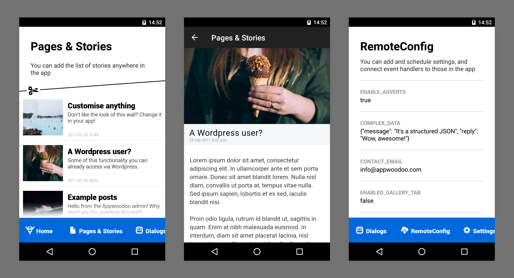

# Appwoodoo Android SDK

`v3.2.1`

Appwoodoo is the simplest way to add an admin panel to existing or new apps, to edit their content.

## Quick start

To see the example app at work, open the `Example` folder with Android Studio, run a Gradle update and then run the app on any device or emulator.

   

## Features:

* [Rich-text pages: stories, news, terms and conditions pages](http://www.appwoodoo.com/docs/android_stories_and_pages/)
* [Remote settings and A/B tests](http://www.appwoodoo.com/docs/android_quick_start/)
* [Push notifications](http://www.appwoodoo.com/docs/android_push_notifications/)
* Dialogs & scheduled pop-ups
* Photos & galleries (coming soon)

## Usage

Adding Appwoodoo to any Android app is as simple as adding these two lines to the app's Gradle build:

```java
dependencies {
    compile 'com.google.android.gms:play-services-gcm:10.2.0'
    compile 'com.appwoodoo:appwoodoo:3.2.0'
    ...
}
```

If the jCenter repository is not included yet, then in the same build file:

```java
repositories {
    jcenter()
    ...
}
```

See the [full documentation](http://www.appwoodoo.com/docs/android_quick_start/) here (or check out the Example app's code for details).

## Recent version highlights

* `3.2.1`: New example app
* `3.0.1`: Initial StoryWall feature
* `2.6.0`: Support to set your own notification sounds

## About

Feel free to open tickets on this package or change the code in any way. You can also send an e-mail to info-AT-appwoodoo.com with your ideas and suggestions. Special thanks to [@sianis](https://github.com/sianis/) for already having done so.

Copyright (c) 2013-2017 Appwoodoo ([appwoodoo.com](www.appwoodoo.com))
